# FreeLLMAPI Quota Pools & Provider Routing Architecture

This document describes how **FreeLLMAPI** dynamically maps, tracks, and routes LLM model requests across provider quota pools without relying on hardcoded model lists or static rate limits.

---

## 📊 Shared Quota Pool Flowchart (Mermaid)

The diagram below tracks how the FreeLLMAPI Unified Router handles incoming client requests, resolves target models, and routes traffic through provider-level shared quota pools:

```mermaid
flowchart TD
    subgraph ClientLayer ["Client Request Layer"]
        ClientRequest["⚡ User / Agent Request"]
        UnifiedRouter["🎯 FreeLLMAPI Router (Bandit & Failure-Aware)"]
        ClientRequest --> UnifiedRouter
    end

    subgraph ProviderLayer ["Upstream Provider Layer"]
        GoogleProvider["🏢 Google Gemini"]
        GroqProvider["🏢 Groq"]
        NvidiaProvider["🏢 NVIDIA NIM"]
        OpenRouterProvider["🏢 OpenRouter"]
        CerebrasProvider["🏢 Cerebras"]
        OllamaProvider["🏢 Ollama Cloud"]
        CloudflareProvider["🏢 Cloudflare Workers AI"]
        HuggingFaceProvider["🏢 HuggingFace Router"]
    end

    UnifiedRouter --> GoogleProvider
    UnifiedRouter --> GroqProvider
    UnifiedRouter --> NvidiaProvider
    UnifiedRouter --> OpenRouterProvider
    UnifiedRouter --> CerebrasProvider
    UnifiedRouter --> OllamaProvider
    UnifiedRouter --> CloudflareProvider
    UnifiedRouter --> HuggingFaceProvider

    subgraph PoolLayer ["Shared Quota Pools"]
        GooglePool["🏊 google::project<br/>(RPM/RPD Shared)"]
        GroqPool["🏊 groq::account<br/>(RPM/TPM Shared)"]
        NvidiaPool["🏊 nvidia::credit-pool<br/>(Credits Shared)"]
        ORFreePool["🏊 openrouter::free<br/>(Zero-Cost Pool)"]
        CerebrasPool["🏊 cerebras::shared<br/>(Day/Min Caps)"]
        OllamaPool["🏊 ollama::cloud<br/>(Session Caps)"]
        CloudflarePool["🏊 cloudflare::account<br/>(Account Pool)"]
        HFPool["🏊 huggingface::router<br/>(Monthly Credit)"]
    end

    GoogleProvider --> GooglePool
    GroqProvider --> GroqPool
    NvidiaProvider --> NvidiaPool
    OpenRouterProvider --> ORFreePool
    CerebrasProvider --> CerebrasPool
    OllamaProvider --> OllamaPool
    CloudflareProvider --> CloudflarePool
    HuggingFaceProvider --> HFPool

    subgraph ModelLayer ["Dynamic LLM Models"]
        GeminiFlash["🤖 gemini-2.5-flash"]
        GeminiPro["🤖 gemini-2.5-pro"]
        
        GroqLlama["🤖 llama-3.3-70b-versatile"]
        GroqR1["🤖 deepseek-r1-distill-llama-70b"]

        NvidiaDeepSeek["🤖 deepseek-v4-pro"]
        NvidiaLlama["🤖 meta/llama-3.3-70b-instruct"]

        ORLlama["🤖 meta-llama/llama-3.3-70b:free"]
        ORDeepSeek["🤖 deepseek/deepseek-r1:free"]

        CerebrasLlama["🤖 llama3.3-70b"]

        OllamaReasoning["🤖 glm-4.7"]
        OllamaKimi["🤖 kimi-k2-thinking"]
    end

    GooglePool --> GeminiFlash
    GooglePool --> GeminiPro

    GroqPool --> GroqLlama
    GroqPool --> GroqR1

    NvidiaPool --> NvidiaDeepSeek
    NvidiaPool --> NvidiaLlama

    ORFreePool --> ORLlama
    ORFreePool --> ORDeepSeek

    CerebrasPool --> CerebrasLlama

    OllamaPool --> OllamaReasoning
    OllamaPool --> OllamaKimi

    %% Styles
    classDef routerStyle fill:#1e1b4b,stroke:#818cf8,stroke-width:2px,color:#e0e7ff
    classDef providerStyle fill:#0f172a,stroke:#38bdf8,stroke-width:2px,color:#f0f9ff
    classDef poolStyle fill:#14532d,stroke:#4ade80,stroke-width:2px,color:#f0fdf4
    classDef modelStyle fill:#1e293b,stroke:#94a3b8,stroke-width:1px,color:#f8fafc

    class ClientRequest,UnifiedRouter routerStyle
    class GoogleProvider,GroqProvider,NvidiaProvider,OpenRouterProvider,CerebrasProvider,OllamaProvider,CloudflareProvider,HuggingFaceProvider providerStyle
    class GooglePool,GroqPool,NvidiaPool,ORFreePool,CerebrasPool,OllamaPool,CloudflarePool,HFPool poolStyle
    class GeminiFlash,GeminiPro,GroqLlama,GroqR1,NvidiaDeepSeek,NvidiaLlama,ORLlama,ORDeepSeek,CerebrasLlama,OllamaReasoning,OllamaKimi modelStyle
```

---

## ⚡ How Quota Pooling & Dynamic Routing Works

1. **Zero Hardcoding**: Model metadata and provider limits are discovered dynamically via `/v1/models` provider endpoints (`discoverProviderModels`) and synced automatically into the local catalog.
2. **Quota Pool Inferencing**: Models are grouped into quota pools based on `inferQuotaPoolKey(platform, modelId)`. Models belonging to the same provider account share rate limit budgets (RPM, RPD, TPM, TPD).
3. **Response Header Header Parsing**: Upstream `x-ratelimit-*` and `retry-after` headers update the active quota remaining values in real-time.
4. **Failure-Aware Failover**: If a model exhausts its pool limit (e.g. HTTP 429 or 402), the router automatically cools down the quota pool and fails over to an alternative model or provider in the group.
